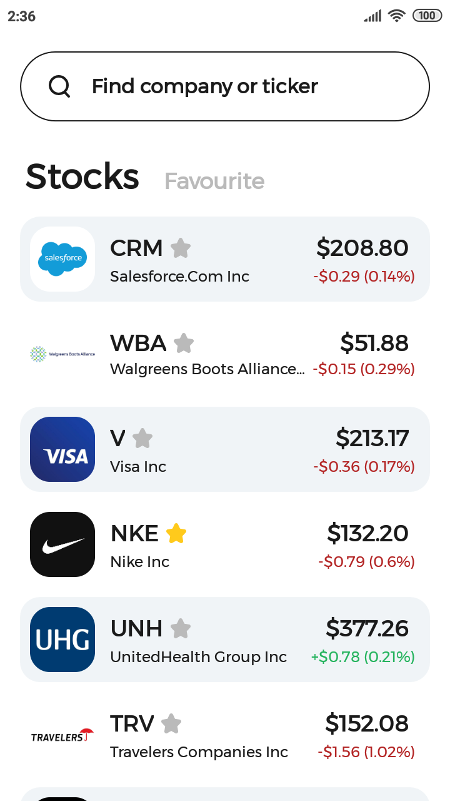
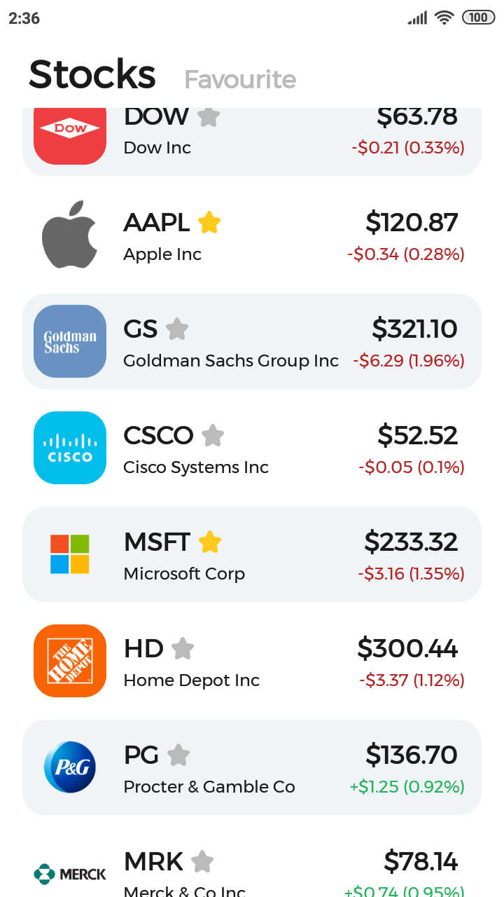
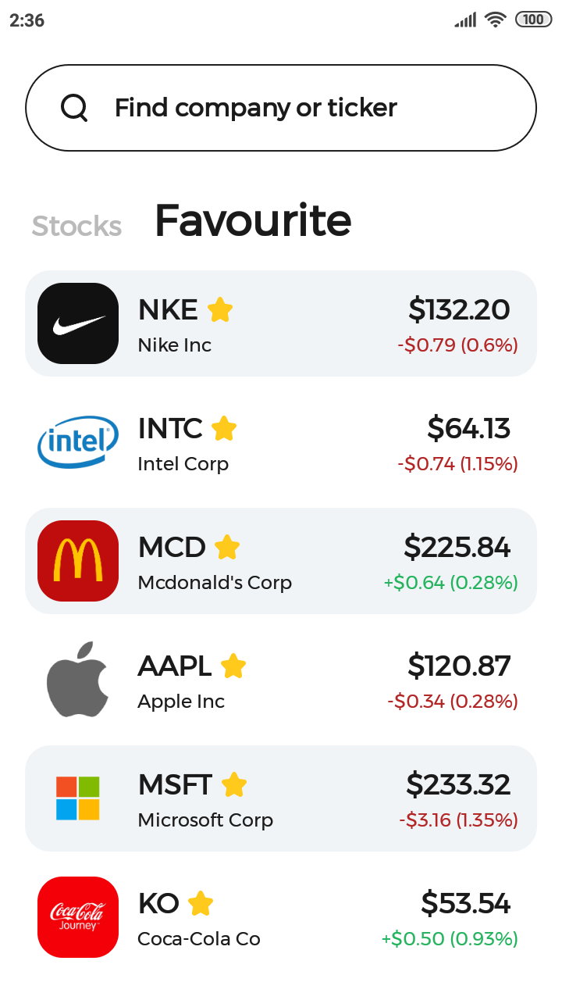
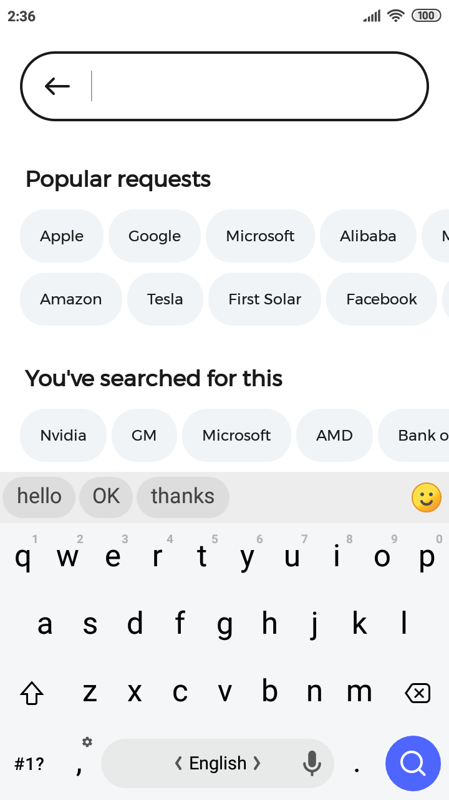
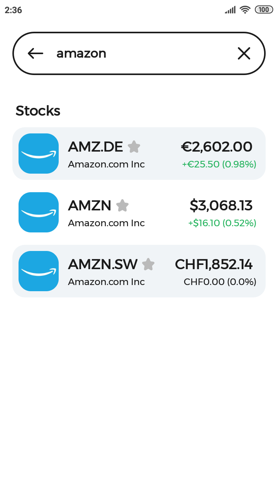

# Stonks

An app for monitoring your favourite stocks price changes.

## Screenshots

Stock list | Stock list (scrolled) | Favourite stocks | Search | Search results
--- | --- | --- | --- | ---
 |  |  |  | 

## Built With

* Kotlin + Coroutines
* AndroidX libraries:
  * Room
  * Navigation component
  * Lifecycle (LiveData, ViewModel)
* Retrofit + Moshi
* Coil

## Acknowledgments

* [UI design](https://www.figma.com/file/bfd6MTBekSVfUYBXWYnj1U/ШМР-Тестовое) by @yandex
* Stock data provided by [Financial Modeling Prep](https://financialmodelingprep.com/developer/docs/)
