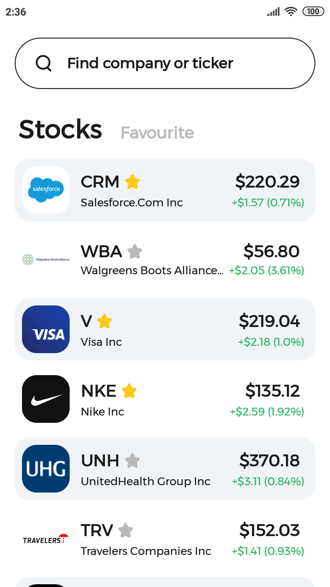
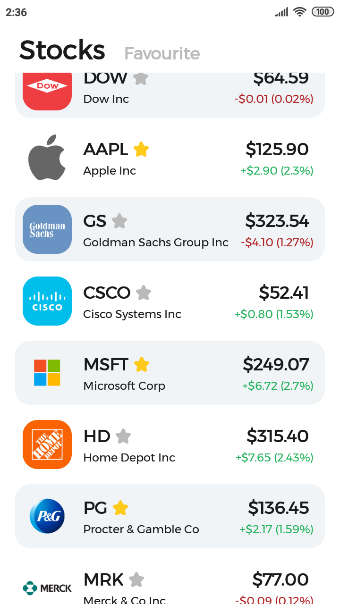
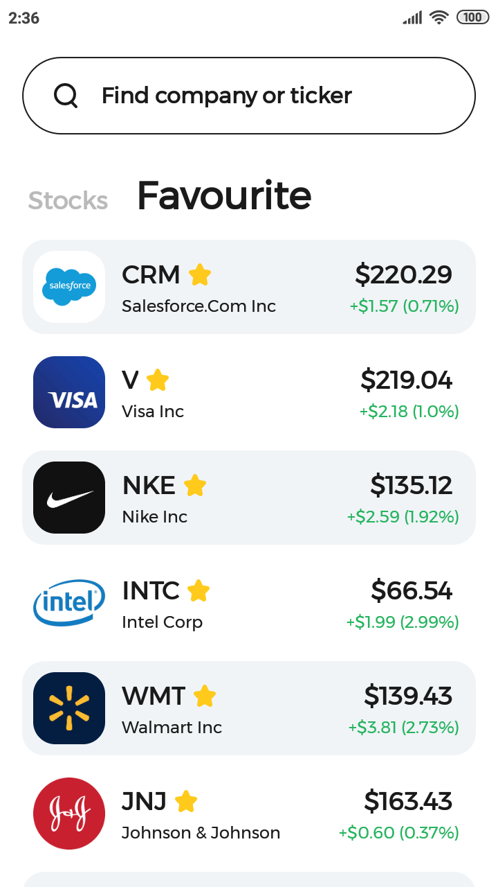
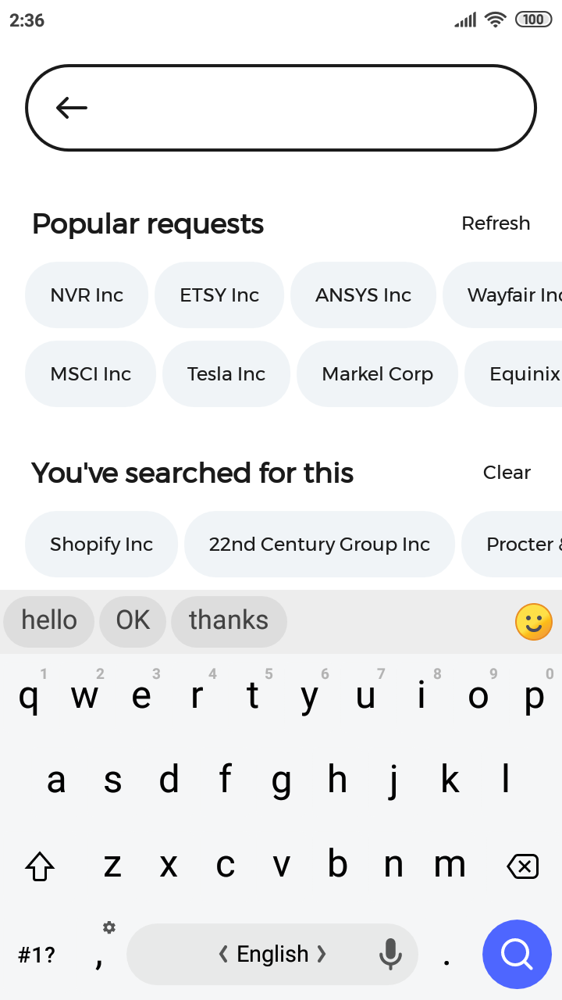
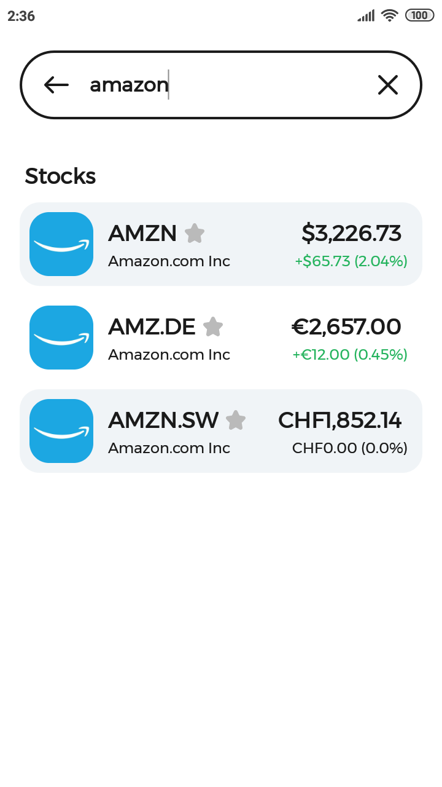
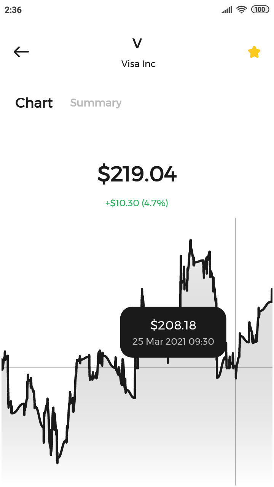
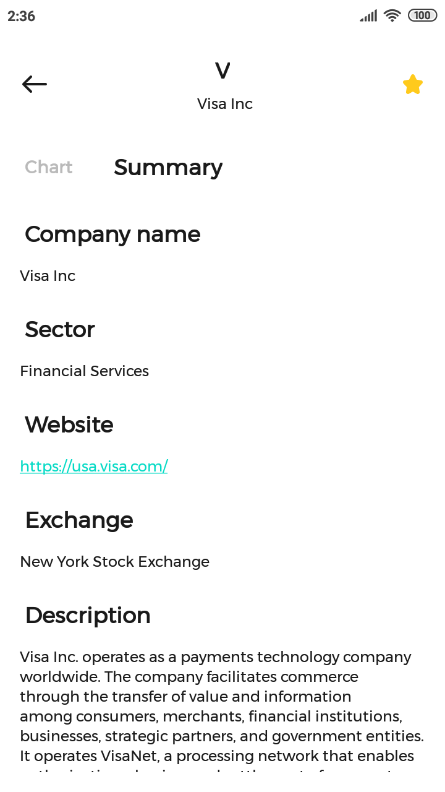

# Stonks

An app for monitoring your favourite stocks price changes.

## Screenshots

Stock list | Stock list (scrolled) | Favourite stocks |
--- | --- | --- |
 |  | 

Search | Search results
--- | ---
 | 

Stock profile (chart) | Stock profile (summary)
--- | ---
 | 

## Built With

* [Kotlin](https://developer.android.com/kotlin) + [Coroutines](https://developer.android.com/kotlin/coroutines)
* AndroidX libraries:
  * [Room](https://developer.android.com/jetpack/androidx/releases/room)
  * [Navigation component + SafeArgs](https://developer.android.com/jetpack/androidx/releases/navigation)
  * [Lifecycle](https://developer.android.com/jetpack/androidx/releases/lifecycle) (LiveData, ViewModel)
* [Retrofit](https://github.com/square/retrofit) + [Moshi](https://github.com/square/moshi)
* [Coil](https://github.com/coil-kt/coil)
* [MPAndroidChart](https://github.com/PhilJay/MPAndroidChart)

## Acknowledgments

* [UI design](https://www.figma.com/file/bfd6MTBekSVfUYBXWYnj1U/ШМР-Тестовое) by [@yandex](https://github.com/yandex)
* Stock data provided by [Financial Modeling Prep](https://financialmodelingprep.com/developer/docs/)
